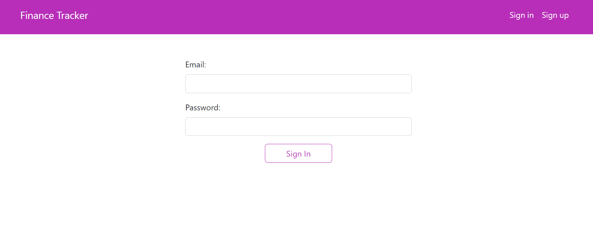

# FinanceTracker
A React application with Supabase as backend where users can log in to their account and add their everyday transactions.

# Styles
I used bootstrap 5 to style the app along with sass to add my custom styles

# Backend
Supabase has been used for Authentication and storing users data in database, Supabase is a backend as a servise platform where you can directly create your database there, having user authentication for your website (Supabse uses Postgres as database), etc. They offer three main products such as database, storage, authentication.

## Run the application
In the project directory, you can run:
#### `npm install` to install project dependencies to the local node_modules folder
#### `npm start` to start the react app
